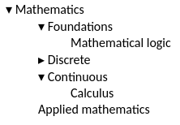

# Collapsible Tree View in Elm

Simple collapsible tree component based on unordered lists written in [Elm](http://elm-lang.org/).
To try it run `elm make Main.elm --output tree.js` and open `index.html` in your browser.

## Example

